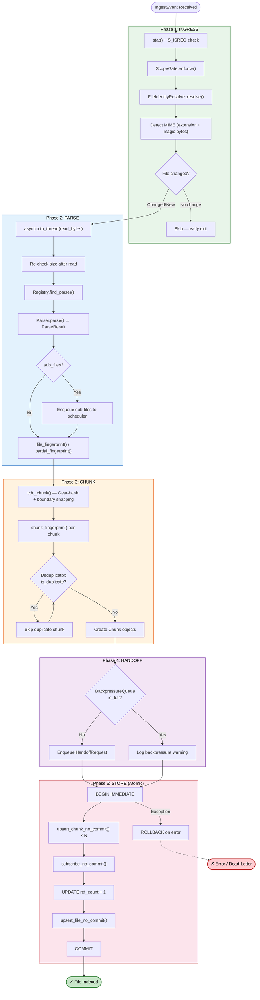
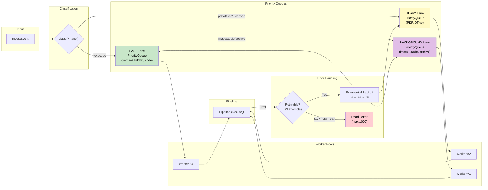
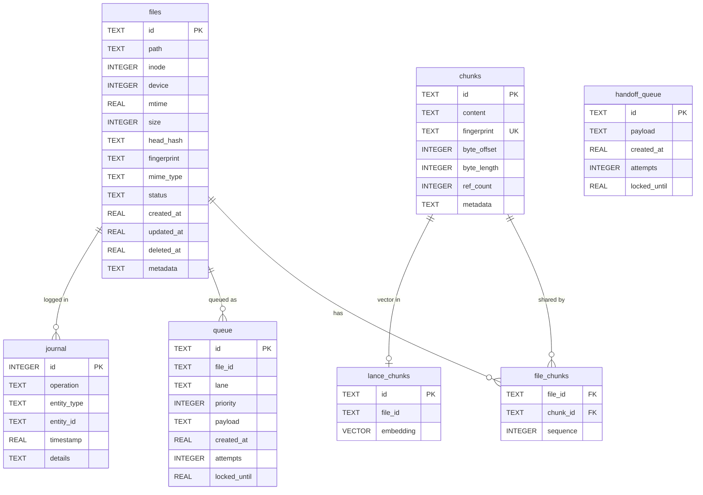
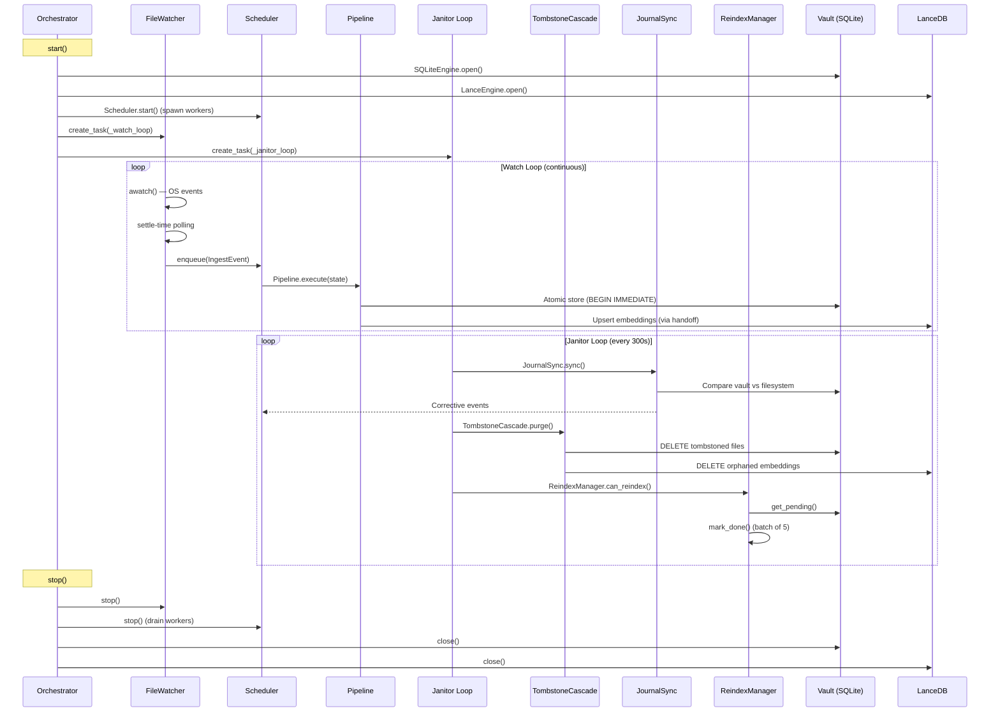

# LocalBrain Architecture

## System Overview

```mermaid
graph TB
    subgraph External["External Systems"]
        FS["File System<br/>(OS Events)"]
        ROUTER["Router App<br/>(AI Gateway)"]
        CLIENT["API Clients<br/>(HTTP)"]
    end

    subgraph Gateway["Gateway Layer"]
        APP["FastAPI App<br/><i>gateway/main.py</i>"]
        MW_CTX["RequestContext<br/>Middleware"]
        MW_AUTH["Auth<br/>Middleware"]
        MW_CORS["CORS<br/>Middleware"]
        ROUTES["API Routes<br/><i>gateway/server.py</i>"]
        ERR["Error Handler<br/><i>utils/errors.py</i>"]
    end

    subgraph Core["Core Engine"]
        ORCH["Orchestrator<br/><i>core/orchestrator.py</i>"]
        SCHED["Scheduler<br/><i>core/scheduler.py</i>"]
        PIPE["IngestPipeline<br/><i>core/pipeline.py</i>"]
        REG["PluginRegistry<br/><i>core/registry.py</i>"]
    end

    subgraph Ingress["Ingress Layer"]
        WATCH["FileWatcher<br/><i>ingress/watcher.py</i>"]
        GATE["ScopeGate<br/><i>ingress/scope_gate.py</i>"]
        IDENT["FileIdentityResolver<br/><i>ingress/identity.py</i>"]
    end

    subgraph Parsers["Document Parsers"]
        TXT["TextParser"]
        PDF["PdfParser"]
        OFF["OfficeParser"]
        IMG["ImageParser"]
        AUD["AudioParser"]
        ARC["ArchiveParser"]
    end

    subgraph AIParsers["AI Platform Parsers"]
        GPT["ChatGPTParser<br/><i>chatgpt_ext.py</i>"]
        CLD["ClaudeParser<br/><i>claude_ext.py</i>"]
        GEM["GeminiParser<br/><i>gemini_ext.py</i>"]
        GEN["AIGenericParser<br/><i>ai_generic_ext.py</i><br/>(Copilot, Perplexity)"]
    end

    subgraph Chunking["Chunking Engine"]
        CDC["CDC Chunker<br/><i>chunking/cdc.py</i>"]
        DEDUP["ChunkDeduplicator<br/><i>chunking/dedup.py</i>"]
        FP["Fingerprinter<br/><i>chunking/fingerprint.py</i>"]
    end

    subgraph Vault["Dual Storage Vault"]
        SQLITE["SQLiteEngine<br/><i>vault/sqlite_engine.py</i>"]
        LANCE["LanceEngine<br/><i>vault/lance_engine.py</i>"]
        SUBS["SubscriptionManager<br/><i>vault/subscriptions.py</i>"]
        REFS["RefCounter<br/><i>vault/ref_counting.py</i>"]
        SCHEMA["Schema DDL<br/><i>vault/schema.py</i>"]
    end

    subgraph Handoff["Router Handoff"]
        BPQ["BackpressureQueue<br/><i>backpressure_queue.py</i>"]
        GWC["GatewayClient<br/><i>gateway_client.py</i>"]
    end

    subgraph Janitor["Maintenance"]
        TOMB["TombstoneCascade<br/><i>janitor/tombstone.py</i>"]
        SYNC["JournalSync<br/><i>janitor/sync.py</i>"]
        REIDX["ReindexManager<br/><i>janitor/reindex.py</i>"]
    end

    %% External connections
    FS -->|OS events| WATCH
    CLIENT -->|HTTP| APP
    GWC <-->|embeddings/OCR| ROUTER

    %% Gateway flow
    APP --> MW_CTX --> MW_AUTH --> MW_CORS --> ROUTES
    APP --> ERR
    ROUTES --> ORCH

    %% Core flow
    ORCH --> WATCH
    ORCH --> SCHED
    ORCH --> PIPE
    ORCH --> TOMB
    ORCH --> SYNC
    ORCH --> REIDX
    SCHED --> PIPE

    %% Ingress
    WATCH --> GATE
    WATCH --> IDENT
    PIPE --> GATE
    PIPE --> IDENT

    %% Parsing
    PIPE --> REG
    REG --> TXT
    REG --> PDF
    REG --> OFF
    REG --> IMG
    REG --> AUD
    REG --> ARC
    REG --> GPT
    REG --> CLD
    REG --> GEM
    REG --> GEN

    %% Chunking
    PIPE --> CDC
    PIPE --> DEDUP
    PIPE --> FP
    CDC --> FP

    %% Storage
    PIPE --> SQLITE
    PIPE --> SUBS
    PIPE --> REFS
    SQLITE --> SCHEMA
    LANCE --> LANCE

    %% Handoff
    PIPE --> BPQ
    BPQ --> GWC

    %% Janitor
    TOMB --> SQLITE
    TOMB --> LANCE
    TOMB --> SUBS
    TOMB --> REFS
    SYNC --> SQLITE
    REIDX --> SQLITE
    REIDX --> SUBS

    %% Styling
    classDef external fill:#f9f,stroke:#333,stroke-width:2px,color:#000
    classDef gateway fill:#bbf,stroke:#333,stroke-width:1px,color:#000
    classDef core fill:#fbb,stroke:#333,stroke-width:1px,color:#000
    classDef ingress fill:#bfb,stroke:#333,stroke-width:1px,color:#000
    classDef parser fill:#ffd,stroke:#333,stroke-width:1px,color:#000
    classDef chunk fill:#dff,stroke:#333,stroke-width:1px,color:#000
    classDef vault fill:#fdb,stroke:#333,stroke-width:1px,color:#000
    classDef handoff fill:#dbf,stroke:#333,stroke-width:1px,color:#000
    classDef janitor fill:#ddd,stroke:#333,stroke-width:1px,color:#000

    class FS,ROUTER,CLIENT external
    class APP,MW_CTX,MW_AUTH,MW_CORS,ROUTES,ERR gateway
    class ORCH,SCHED,PIPE,REG core
    class WATCH,GATE,IDENT ingress
    class TXT,PDF,OFF,IMG,AUD,ARC parser
    class GPT,CLD,GEM,GEN parser
    class CDC,DEDUP,FP chunk
    class SQLITE,LANCE,SUBS,REFS,SCHEMA vault
    class BPQ,GWC handoff
    class TOMB,SYNC,REIDX janitor
```



---

## 5-Phase Ingestion Pipeline



---

## Scheduler & Worker Architecture



---

## Data Storage Schema



---

## Background Task Lifecycle



---

## File Tree

```
LocalBrain/
├── pyproject.toml              # Project config (UV, pytest)
├── Dockerfile                  # Multi-stage build
├── README.md                   # Documentation
├── access.config.json          # Scope-gate config (whitelist dirs)
├── plugins.yaml                # Parser plugin declarations
├── conftest.py                 # pytest shared fixtures
│
├── src/
│   ├── core/
│   │   ├── models.py           # 12 Pydantic v2 models + 3 enums
│   │   ├── state.py            # IngestState mutable container
│   │   ├── pipeline.py         # 5-phase ingestion engine
│   │   ├── scheduler.py        # 3-lane priority scheduler + retry
│   │   ├── orchestrator.py     # Top-level lifecycle wiring
│   │   └── registry.py         # YAML plugin discovery
│   │
│   ├── ingress/
│   │   ├── watcher.py          # Hybrid file watcher (watchfiles)
│   │   ├── scope_gate.py       # Whitelist/blocklist enforcement
│   │   └── identity.py         # Inode+device+mtime+size+hash tracking
│   │
│   ├── parsers/
│   │   ├── base.py             # Abstract ParserBase
│   │   ├── text_ext.py         # Plain text, markdown, code
│   │   ├── pdf_ext.py          # PDF (pymupdf + fallback)
│   │   ├── office_ext.py       # DOCX, XLSX, PPTX
│   │   ├── image_ext.py        # EXIF extraction (OCR via Router)
│   │   ├── audio_ext.py        # Metadata stub (transcription via Router)
│   │   ├── archive_ext.py      # ZIP/TAR VFS sandbox
│   │   ├── chatgpt_ext.py      # ChatGPT conversations (tree linearisation)
│   │   ├── claude_ext.py       # Claude conversations (linear messages)
│   │   ├── gemini_ext.py       # Gemini/Bard (3 format variants + HTML)
│   │   └── ai_generic_ext.py   # Copilot, Perplexity (JSON/MD/CSV)
│   │
│   ├── chunking/
│   │   ├── cdc.py              # Gear-hash CDC + boundary snapping
│   │   ├── dedup.py            # LRU fingerprint cache (500K cap)
│   │   └── fingerprint.py      # xxHash (file, chunk, partial, head)
│   │
│   ├── vault/
│   │   ├── schema.py           # DDL for 5 tables + 9 indices
│   │   ├── sqlite_engine.py    # Full CRUD + journal + queue
│   │   ├── lance_engine.py     # LanceDB vector store
│   │   ├── subscriptions.py    # Many-to-many file↔chunk mapping
│   │   └── ref_counting.py     # ACID reference counting
│   │
│   ├── router_handoff/
│   │   ├── backpressure_queue.py  # SQLite-backed durable queue
│   │   └── gateway_client.py      # httpx client with retry
│   │
│   ├── janitor/
│   │   ├── tombstone.py        # 7-day soft-delete cascade
│   │   ├── sync.py             # Journal-based drift detection
│   │   └── reindex.py          # Lazy re-index (idle + AC power)
│   │
│   ├── gateway/
│   │   ├── main.py             # FastAPI factory + middleware
│   │   └── server.py           # 9 API endpoints
│   │
│   └── utils/
│       ├── config.py           # Pydantic settings (env vars)
│       ├── errors.py           # 12-class error hierarchy
│       └── logging.py          # Structured JSON logging
│
└── tests/                      # 285 tests across 31 files
    ├── test_chunking/          # CDC, dedup, fingerprint
    ├── test_core/              # Models, pipeline, scheduler, orchestrator, registry
    ├── test_gateway/           # Server endpoints, error handling, middleware
    ├── test_ingress/           # Identity, scope gate, watcher
    ├── test_janitor/           # Tombstone, sync, reindex
    ├── test_parsers/           # Text, PDF, office, image, audio, archive,
    │                           # ChatGPT, Claude, Gemini, Copilot/Perplexity
    ├── test_router_handoff/    # Backpressure queue, gateway client
    ├── test_utils/             # Config (with validation), logging
    └── test_vault/             # SQLite, LanceDB, ref counting, subscriptions
```
